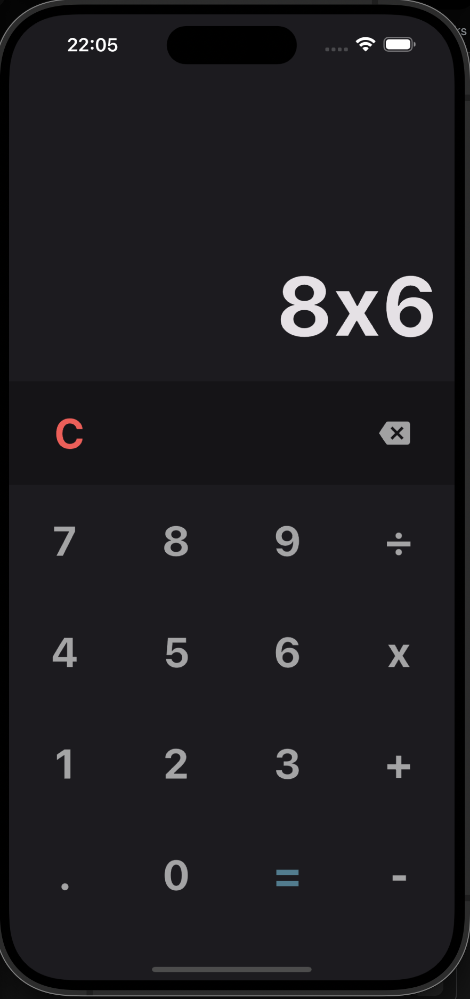

# Flutter Calculator App

Welcome to the Flutter Calculator App README! This is a simple calculator application built using Flutter, a popular UI toolkit for building natively compiled applications for mobile, web, and desktop from a single codebase.

## Features

- Addition
- Subtraction
- Multiplication
- Division
- Decimals
- Clearing Screen
- Backspace
- Dynamic Screen

## Getting Started

To get started with this calculator app, follow these steps:

1. Ensure you have Flutter installed on your system. If not, you can follow the instructions on the official Flutter website: [Flutter Installation Guide](https://flutter.dev/docs/get-started/install)
2. Clone this repository to your local machine:
```
git clone <repository-url>
```
3. Navigate to the project directory:
```
cd flutter_calculator_app
```
4. Run the app on your preferred device (emulator or physical device):
```
flutter run
```


## Usage

Once the app is running on your device, you can perform various calculations using the calculator interface. Here's a quick overview of how to use the app:

- **Addition**: Use the `+` button to add numbers.
- **Subtraction**: Use the `-` button to subtract numbers.
- **Multiplication**: Use the `×` button to multiply numbers.
- **Division**: Use the `÷` button to divide numbers.
- **Decimals**: You can input decimal numbers using the `.` button.
- **Clearing Screen**: Use the `C` button to clear the screen and start a new calculation.
- **Backspace**: Use the `←` button to delete the last entered digit.
- **Dynamic Screen**: The screen dynamically displays the input and result of the calculation as you enter numbers and operations.

## Screenshots



## Contributing

Contributions are welcome! If you'd like to contribute to this project, feel free to submit a pull request.

## License

This project is licensed under the [MIT License](LICENSE).
